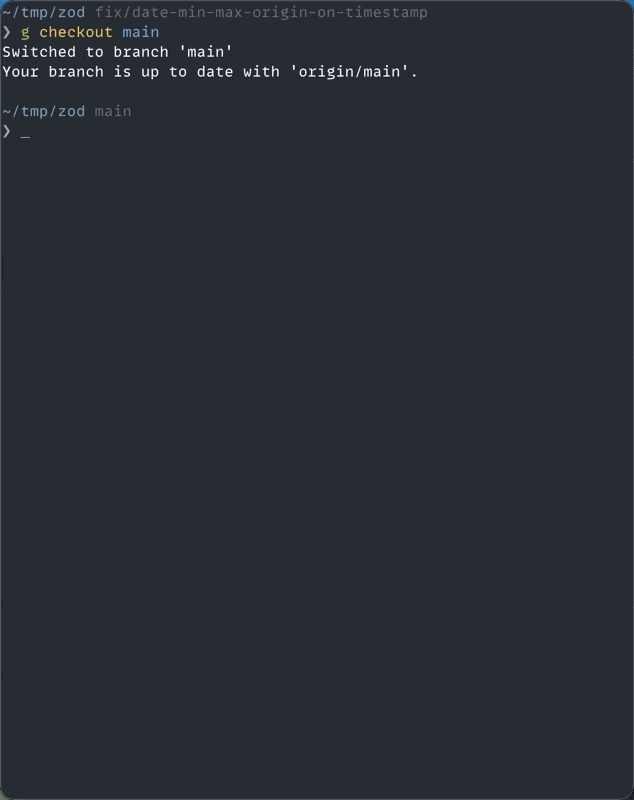

<p align="center">
  <picture>
    <source media="(prefers-color-scheme: dark)" srcset="assets/prsense-logo-dark.svg">
    <source media="(prefers-color-scheme: light)" srcset="assets/prsense-logo-light.svg">
    
  </picture>
</p>
<h1 align="center">PRSense</h1>
<p align="center">
  <sub>High-confidence signals grounded in diff</sub>
</p>

**PRSense(Patch-Review Sense) is an open-source, LLM-powered code review engine that surfaces high-confidence review signals from diff.**

<p align="center">
  https://discord.gg/sX3WBw8Zr</img>
  
  
  
</p>

> PRSense is experimental software, expect bugs.

## Demo

<p align="center">
  
</p>

## Table of Contents

- [Philosophy](#philosophy)
- [Features](#features)
- [Requirements](#requirements)
- [Installation](#installation)
- [Usage](#usage)
- [Configuration](#configuration)
- [Design](#design)
- [Architecture](#architecture)
- [Command Reference](#command-reference)
- [Benchmarks](#benchmarks)
- [Contributing](#contributing)
- [License](#license)

## Philosophy

PRSense is built around a few core principles:

- human-in-the-loop decision making
- high signal, low noise
- local-first and self-hosted operation
- transparency over automation
- inspectable reasoning
- composability over monoliths
- extensibility via hexagonal architecture - make it your own

## Features

- **Fast, local-first CLI** for reviewing and analyzing code changes
- **Self-hosted by default** — run entirely on your own machine or infrastructure
- One command setup
- Automatically reads your intent from branch name on locally or PR description
- Pluggable models or run everything locally via ollama
- Auto indexing by default for context enriched review
- Human in the loop decision making
- **Diff-first intelligence**, understanding:
  - local changes
  - pull request diffs from GitHub, GitLab
- **Pluggable LLM backends** - Ollama, Anthropic, Google, OpenAI
- Built in profiling
- Automatically reads from and writes to local `.env`
- Supports remote repositories from GitHub, GitLab
- AST based chunking for TypeScript(more langs on the roadmap)
- Deterministic pipeline for identifying cross file issues
- Bundled `pre-push` git hook
- Tested with real world C, C++, Rust, Go, TypeScript, Python, Java repositories (See [Benchmarks](#benchmarks) and [Example Signals](docs/raw_signals.md))

## Requirements

- Node.Js >= 22 <25
- git >=2.31
- (optional)Ollama

## Installation

`npm i -g @prsense/cli`

## Usage

PRSense is CLI first run in two modes:

- **CLI mode** — local, interactive usage (this package, `@prsense/cli`)

Both modes use the same core review engine and configuration model.

### CLI Mode

The CLI is ideal for local development and experimentation.

#### Review a local repository

```bash
prsense review .
```

Compares your current branch against the configured base branch and prints review signals to stdout.

#### Review a GitHub Pull Request

```bash
prsense review https://github.com/owner/repo/pull/123
```

#### Review a GitLab Merge Request

```bash
prsense review https://gitlab.com/group/project/-/merge_requests/42
```

#### Index a repository (enable contextual review)

```bash
prsense index .
```

This builds a semantic index of the repository to enable contextual (RAG-enhanced) reviews.

Optional flags:

```bash
prsense index . --force
prsense index . --dry-run
prsense index . --stats
```

### Typical Workflows

#### Local Development

1. `prsense index .`
2. `prsense review .`

## Configuration

This is the configuration structure

```
defaults
   ↓
global config
   ↓
repo config
   ↓
environment variables
   ↓
derive runtime fields
   ↓
validate
   ↓
Resolved Environment
```

PRSense separates **review behavior** from **runtime infrastructure configuration**.

Configuration is layered and deterministic.

### Configuration Layers (Lowest → Highest Priority)

1. Built-in defaults
2. Global config (`~/.config/prsense/config.yml`)
3. Repository config (`prsense.yml`)
4. CLI flags (when applicable)

Environment variables are used exclusively for **credentials and infrastructure**, never review behavior.

This ensures:

- Reproducible reviews
- No secrets in source control
- Deterministic layering
- Clear separation of domain vs runtime concerns

## Global Configuration (Optional)

Location:

```
$XDG_CONFIG_HOME/prsense/config.yml
```

or

```
~/.config/prsense/config.yml
```

Global config defines personal defaults applied to all repositories.

Example:

```yaml
llm:
  provider: ollama
  model: qwen2.5-coder
  temperature: 0.1

embeddings:
  provider: ollama
  model: nomic-embed-text
```

Repository config overrides global config.

## Repository Configuration (`prsense.yml`)

Placed at the root of your repository.

This file defines review behavior:

- LLM provider and model
- Embedding model
- Chunking strategy
- Review thresholds
- Retrieval limits

## Example

```yaml
llm:
  provider: ollama # ollama | openai | google | anthropic
  model: deepseek-coder-v2
  temperature: 0.1

embeddings:
  provider: ollama # ollama | openai
  model: nomic-embed-text

index:
  chunkSizeChars: 1000
  chunkOverlapChars: 200

review:
  confidenceThreshold: 0.8
  maxSignals: 3

context:
  maxChunks: 5

git:
  baseBranch: main
```

## Configuration Sections Explained

## `llm`

Controls review generation model.

Supported providers:

- `ollama`
- `openai`
- `google`
- `anthropic`

`temperature` controls randomness.

Lower values produce more deterministic output.

## `embeddings`

Controls vector embeddings used for indexing and retrieval.

If changed:

- Re-indexing is required.
- Embedding dimensions must match the database schema.

## `index`

Controls repository chunking.

- `chunkSizeChars` — characters per chunk.
- `chunkOverlapChars` — overlap between chunks.

## `review`

Controls signal filtering.

- `confidenceThreshold` — minimum confidence.
- `maxSignals` — maximum number of emitted signals.

## `context`

Controls retrieval (RAG).

- `maxChunks` — number of chunks retrieved per review.

## Environment Variables

Environment variables configure runtime infrastructure and credentials.

They are never stored in `prsense.yml`.

## LLM Credentials

| Provider | Variable                         |
| -------- | -------------------------------- |
| OpenAI   | `PRSENSE_OPENAI_API_KEY`         |
| Gemini   | `PRSENSE_GOOGLE_API_KEY`         |
| Claude   | `PRSENSE_ANTHROPIC_API_KEY`      |
| Ollama   | `PRSENSE_OLLAMA_HOST` (optional) |

## Embeddings (OpenAI)

```
PRSENSE_OPENAI_API_KEY
```

## Database

Bundled sqlite with sqlite-vec. Used for indexing.

```

## GitHub Delivery

### Personal Access Token

```

PRSENSE_GITHUB_TOKEN
PRSENSE_GITHUB_WEBHOOK_SECRET

```

### GitHub App (Recommended)

```

PRSENSE_GITHUB_APP_ID
PRSENSE_GITHUB_APP_PRIVATE_KEY
PRSENSE_GITHUB_INSTALLATION_ID
PRSENSE_GITHUB_WEBHOOK_SECRET

```

## GitLab Delivery

```

PRSENSE_GITLAB_TOKEN
PRSENSE_GITLAB_WEBHOOK_SECRET

```

## Slack Delivery

```

PRSENSE_SLACK_BOT_TOKEN

```

## Logging

```

PRSENSE_LOG_LEVEL=debug | info | warn | error

````


### CLI Mode

- Loads global + repo config
- Ignores `delivery`
- No webhook secrets required
- Can run fully local

Example:

```sh
prsense review .
````

### Inspecting Effective Configuration

You can inspect merged configuration:

```sh
prsense config inspect
```

This shows:

- Global config
- Repository config
- Effective merged config
- Runtime resolved config
- Credential availability

### Defaults

If no configuration is provided:

- `ollama` is used as default LLM
- `nomic-embed-text` used for embeddings
- Safe chunking defaults applied
- No delivery enabled

### Security Notes

- Never commit API keys.
- Never commit webhook secrets.
- Prefer GitHub App over PAT in production.
- Use separate credentials for staging/production.
- Global config should not contain secrets.

### Configuration Summary

| Type              | Location                              | Purpose                |
| ----------------- | ------------------------------------- | ---------------------- |
| Global defaults   | `~/.config/prsense/config.yml`        | Personal defaults      |
| Repository config | `prsense.yml`                         | Review behavior        |
| Credentials       | Environment variables                 | Secrets / API access   |
| Database          | Environment variables                 | Index storage          |
| Delivery channels | `prsense.yml` + environment variables | Posting review results |

PRSense enforces strict separation between domain behavior and runtime credentials to ensure reproducibility, determinism, and security.

## Design

PRSense is built using a hexagonal (ports-and-adapters) architecture.

This design separates core review logic from external concerns such as Git, filesystems, databases, LLM providers, and user interfaces. The goal is to keep the system easy to reason about, test, and extend.

### Core (Domain + Engine)

At the center of PRSense is a small, declarative core:

- domain types such as ReviewSignal and ReviewContext
- pure review logic and orchestration
- no direct IO
- no network access
- no filesystem assumptions

The core does not know where data comes from or where results go. It only operates on well-defined inputs and produces structured outputs.

This makes the core:

- deterministic
- testable
- portable
- resistant to integration churn

### Ports

Ports are the abstract boundaries through which the core interacts with the outside world.

In PRSense, ports take the form of TypeScript interfaces and function contracts, for example:

- context retrievers
- LLM providers
- embedding generators
- vector stores
- reporters

Ports describe _what_ the core needs, not _how_ it is implemented.

### Adapters

Adapters live at the edges of the system and implement ports.

Examples include:

- filesystem-based context retrieval
- git diff ingestion
- Ollama or OpenAI LLM providers
- CLI reporters

Adapters are inherently imperative and may fail. Those failures are handled at the boundary, not inside the core.

### Imperative Shell

The outermost layer consists of applications:

- the CLI
- background workers
- future GitHub integrations

These applications:

- parse user input
- load configuration
- wire adapters together
- call the core
- present results

The shell is free to be messy. The core is not.

### Why This Matters

This architecture allows PRSense to:

- run locally, or as a service
- swap LLM providers without touching review logic
- add new retrieval strategies without rewriting the engine
- remain understandable as complexity grows

Most importantly, it allows PRSense to treat LLMs as interchangeable tools rather than structural dependencies.

The result is a system that is flexible without being fragile.

## Architecture

          ┌─────────────┐
          │   Git / PR  │
          └──────┬──────┘
                 │
            [ Diff Input ]
                 │
        ┌────────▼────────┐
        │ Ingestion       │
        │ (diff + meta)   │
        └────────┬────────┘
                 │
        ┌────────▼────────┐
        │ Context Builder │◄──── Repository, files, history
        └────────┬────────┘
                 │
        ┌────────▼────────┐
        │ Review Engine   │
        │ (LLM + Context) │
        └────────┬────────┘
                 │
        ┌────────▼────────┐
        │ Signal Compiler │
        └────────┬────────┘
                 │
        ┌────────▼────────┐
        │ Reporters       │
        │ (CLI, others)   │
        └─────────────────┘

PRSense follows a hexagonal architecture:

- a declarative domain core
- a functional review engine
- imperative adapters for IO, git, LLMs, and storage

```


CLI  / GitHub App
─────────────── execution environments
Workflows
─────────────── orchestration
Engine / Context / Adapters / LLM
─────────────── capabilities
Domain
─────────────── pure types


```

## Command Reference

A complete command reference is available in:

[docs/man/prsense.1](docs/man/prsense.1)

or just issue `man prsense`

## Benchmarks

Currently benchmarks track the time for each review, token usage, grounding etc for flagship
models and local models via ollama

See [benchmarks.json](packages/bench/bench-results/2026-03-19T14-32-19.234Z.json)

#### Running benchmarking

You can run the benchmarks on your own machine by cloning the repository, installing the packages with `pnpm i` from the root

1. Create a github token and set it up `PRSENSE_GITHUB_BENCH_TOKEN`
2. `pnpm bench`

Make sure all the environment variables related to cloud providers have been set up and ollama is running with the models being tested available

## Contributing

PRs are welcome

## License

PRSense is licensed under the Apache 2.0 License.
